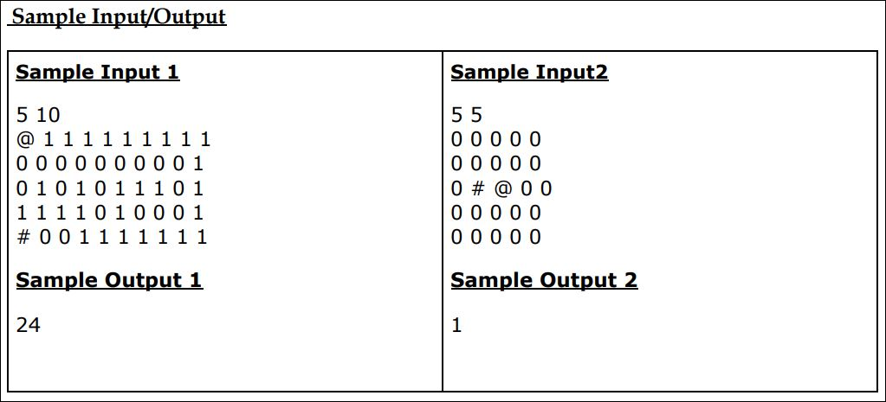

# The Maze problem:

## Problem Statement:

Your starting point in the maze is marked by the character '#' and the entrance to the
library (i.e., end point of the maze) is marked by the character '@', i.e. your program must
start from '#' and end at '@'

The maze is composed of a rectangular array of cells. Apart from the start (#) and end (@)
cells, maze contains solid cells and empty cells. A valid path never passes via a solid cell.
The solid cells are marked by 0s and empty cells are marked by 1s. Once on a cell, you can
only move to any one of the neighbouring four (i.e., north, east, west, south) cells.

## Assumption:

Assume that no path will ever cross itself, i.e., there will be no loops in any path.

## Expected Input:

1. The first line of input will be two integers, R and C, specifying the number of rows
   and columns.
2. The next R lines contain C characters each separated by white space, thereby
   specifying the layout of the maze. It is guaranteed that the maze will contain only
   one starting andone ending character. Also, it is guaranteed that the maze will
   contain only one correct path, from the start point to the end point.

## Output:

The program returns output on one line, the number of hops required to reach the end
point.

## Explaination:



---

```python
startRow = 0
startCol = 0
start = '#'
end = '@'
maze = []

rows, cols = map(int, input("Enter rows X columns: \t").split())

for i in range(rows):
    inputStr = input().split()
    if start in inputStr:
        startCol = inputStr.index(start)
        startRow = i
    maze.append(inputStr)

print('The index of start:', startRow, startCol)

solution = [[0]*cols for _ in range(rows)]  # list to store the solution matrix
hops = 0  # the hop for min solution

# function to solve the maze
# using backtracking


def solvemaze(r, c):
    # getting the hop count with global variable
    global hops
    # if destination is reached, maze is solved
    # destination is the cell with '@'
    if ((r <= rows-1) and (c <= cols-1) and maze[r][c] == '@'):
        solution[r][c] = 1
        return True
    # checking if we can visit in this cell or not
    # and solution[r][c] == 0 is making sure that the cell is not already visited
    # maze[r][c] ==  is making sure that the cell is not blocked
    if r >= 0 and c >= 0 and r < rows and c < cols and solution[r][c] == 0 and (maze[r][c] != 0):
        # visiting a cell
        solution[r][c] = 1
        # Add step assuming it is a valid step towards solution
        hops = hops+1

        # move down
        if solvemaze(r+1, c):
            return True
        # move right
        if solvemaze(r, c+1):
            return True
        # move up
        if solvemaze(r-1, c):
            return True
        # move left
        if solvemaze(r, c-1):
            return True
        # backtracking to previous step
        solution[r][c] = 0
        # Reduce step as it is an invalid step
        hops = hops - 1
        return False
    return 0


if (solvemaze(startRow, startCol)):
    print(hops)
else:
    print("No solution")

```
